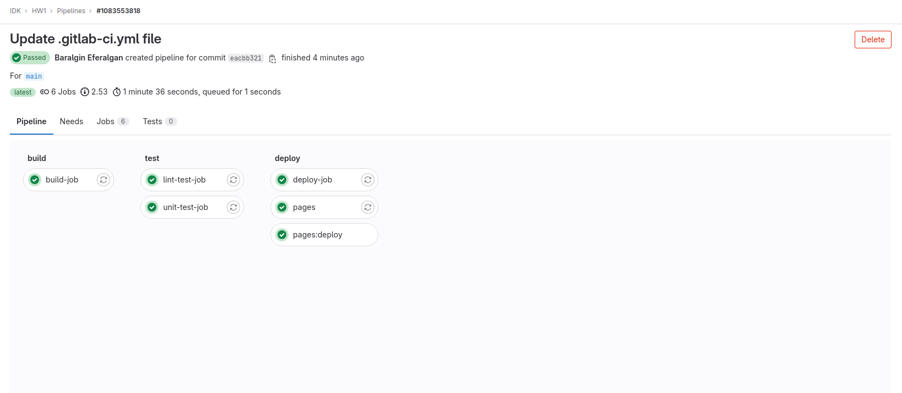

```yaml
stages:
  - build
  - test
  - deploy

build-job:
  stage: build
  script:
    - echo one >> one.txt
    - echo two >> two.txt
  artifacts:
    paths:
      - one.txt
      - two.txt
    exclude:
      - two.txt 
    expire_in: 30 days  


unit-test-job:
  stage: test
  script:
    - echo "Running unit tests... This will take about 60 seconds."
    - grep one one.txt

lint-test-job:
  stage: test
  script:
    - echo "No lint issues found."

deploy-job:
  stage: deploy
  environment: production
  script:
    - echo "Application successfully deployed."

pages:
  stage: deploy
  script:
    - mkdir -p public
    - echo '<!DOCTYPE html><html lang="en"><head><meta charset="UTF-8"><meta name="viewport" content="width=device-width, initial-scale=1.0"><title>Document</title></head><body><div style="font-size:500px;">Hi</div></body></html>' >> public/index.html
  artifacts:
    paths:
      - public
  only:
    - main
```
