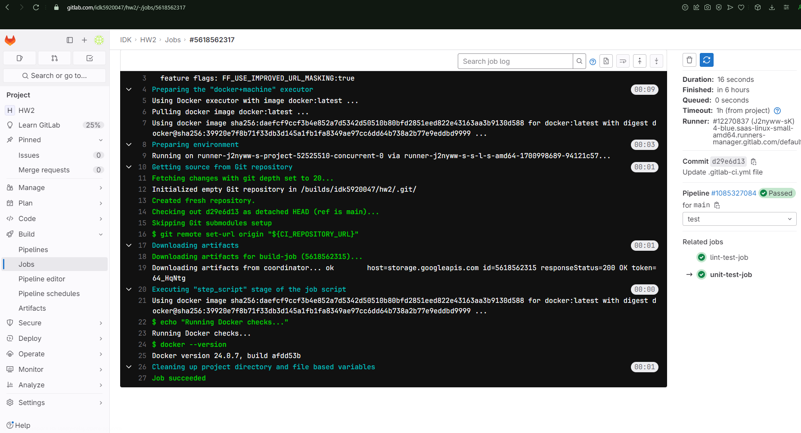

```yaml
image: busybox:latest

stages:
  - build
  - test
  - deploy

variables:
  IMAGE_TAG: $CI_COMMIT_BRANCH-$CI_COMMIT_SHORT_SHA

build-job:
  stage: build
  script:
    - echo one >> one.txt
    - echo two >> two.txt
  artifacts:
    paths:
      - one.txt
      - two.txt
    exclude:
      - two.txt 
    expire_in: 30 days  

docker build:
  image: docker:latest
  stage: build
  services:
    - docker:dind
  script:
    - docker login -u $CI_REGISTRY_USER -p $CI_REGISTRY_PASSWORD $CI_REGISTRY
    - echo $CI_REGISTRY_USER $CI_REGISTRY_PASSWORD $CI_REGISTRY $CI_REGISTRY_IMAGE:$IMAGE_TAG
    - docker build -t $CI_REGISTRY_IMAGE:$IMAGE_TAG -f Dockerfile .
    - docker push $CI_REGISTRY_IMAGE:$IMAGE_TAG

unit-test-job:
  stage: test
  image: docker:latest
  script:
    - echo "Running Docker checks..."
    - docker --version
    
lint-test-job:
  stage: test
  script:
    - echo "No lint issues found."

deploy-job:
  stage: deploy
  environment: production
  script:
    - echo "Application successfully deployed."

pages:
  stage: deploy
  script:
    - mkdir -p public
    - echo '<!DOCTYPE html><html lang="en"><head><meta charset="UTF-8"><meta name="viewport" content="width=device-width, initial-scale=1.0"><title>Document</title></head><body><div style="font-size:500px;">Hi!</div></body></html>' >> public/index.html
  artifacts:
    paths:
      - public
  only:
    - main
```
